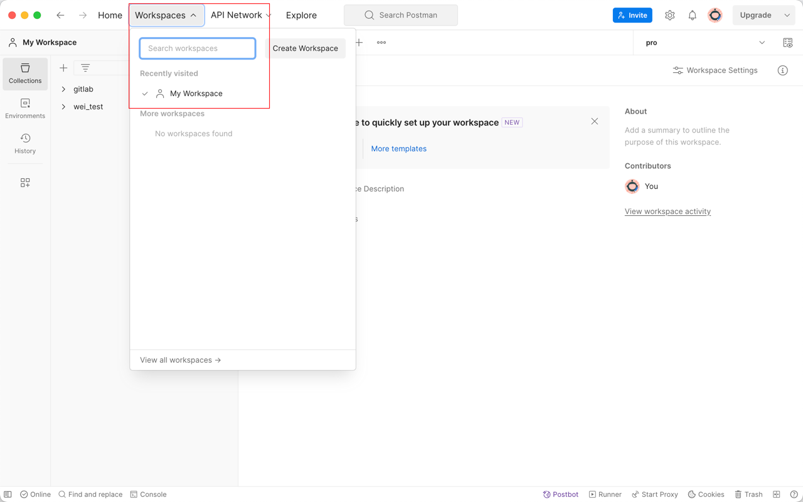
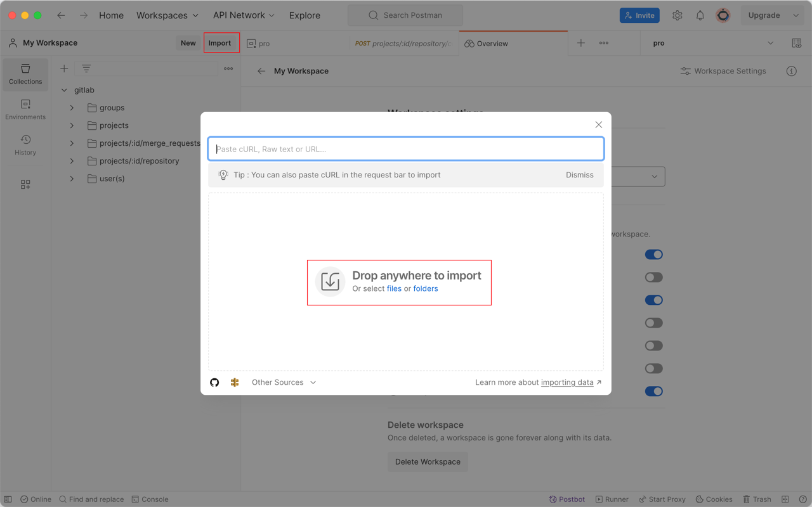
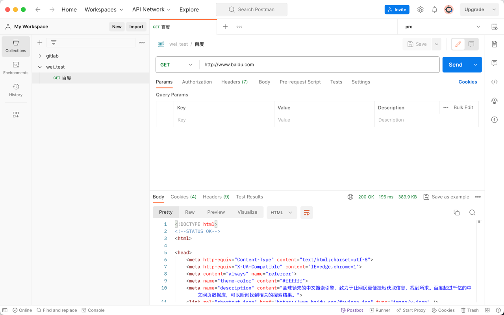
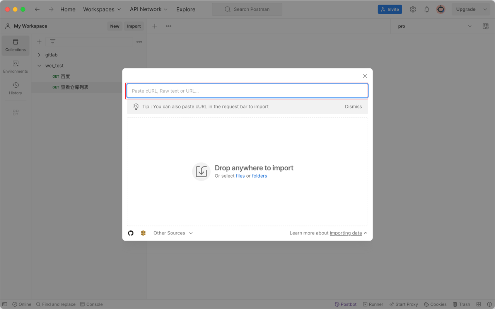
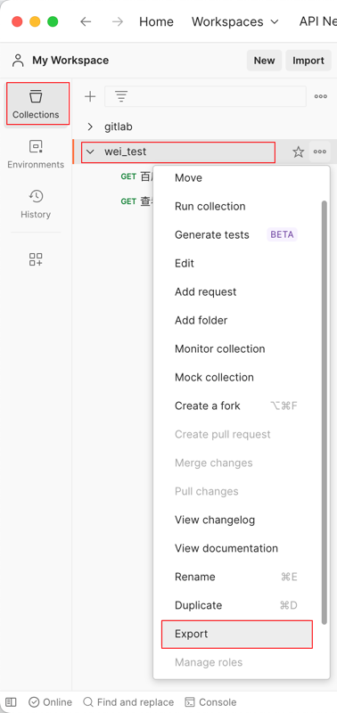
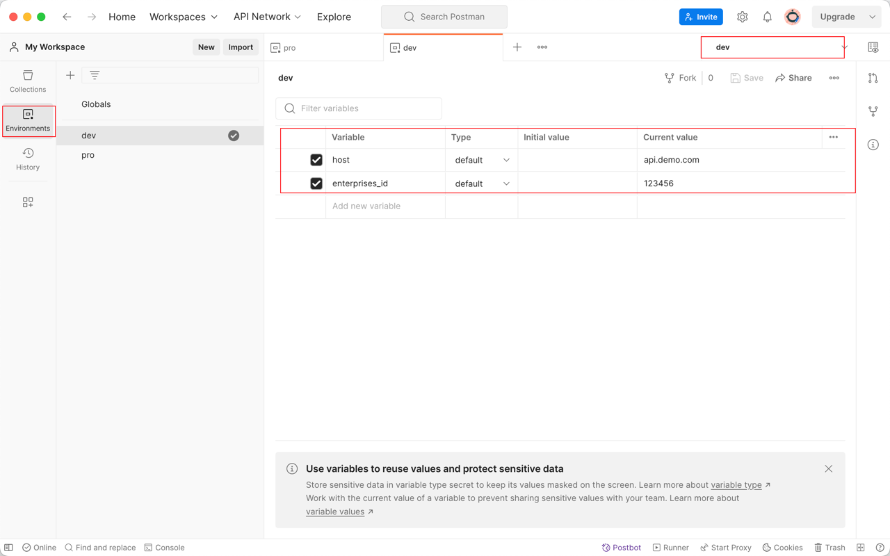
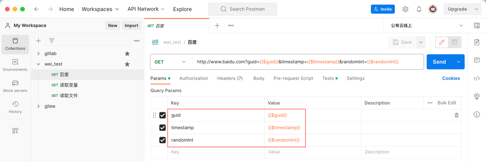
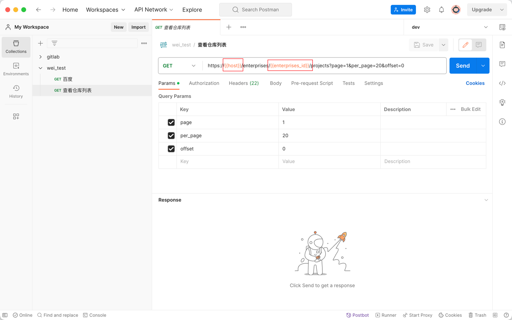
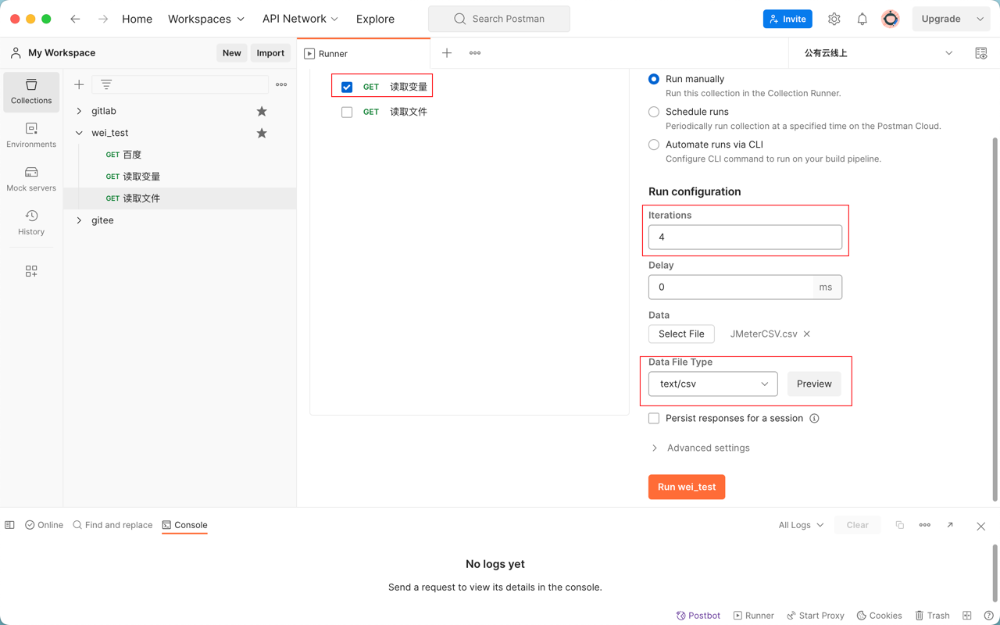

[TOC]

<h1 align="center">Postman</h1>

> By：weimenghua  
> Date：2023.10.13  
> Description：Postman API 测试

**参考资料**   
[Postman 官网](https://www.postman.com/)  
[Postman 教程](https://postman.org.cn/)  
[Gorest 接口](https://gorest.co.in/)  


## 一、环境搭建

[下载 Postman](https://www.postman.com/downloads/) 选择合适的版本进行安装，也可选择 [网页版 Postman](https://web.postman.co/)，注意切换到自己的工作空间。

切换工作空间



Postman 登录后本地数据会和远程数据同步，如果未登录则无法导入文件（踩坑点）。




## 二、使用教程

### 基本操作

请求示例：可使用 `htttp://www.baidu.com` 、`https://gorest.co.in/public/v1/users`。



导入接口：在 web 页面按 F12 打开控制台，选择接口右键复制以 cUrl 格式或者其它格式复制，打开 Postman 点击 Impoet 进行导入，也可选择导入文件或者文件夹。



导出接口：选择 Collections 的集合右键选择 Export 进行导出。




### 环境变量

设置环境变量：在 Enviroments 添加环境变量，可配置多组环境变量，在请求时右上角进行切换组变量。



设置随机变量：注：以下常用变量是指值，并且需要加 $。

```
{{$guid}}       //生成 GUID 
{{$timestamp}}  //当前时间戳 
{{$randomInt}}  //0-1000 的随机整数
```



设置其它变量：在 Test 里添加。
```
使用pm.globals来定义一个全局变量：
pm.globals.set("variable_key", "variable_value");

使用pm.collectionVariables定义集合变量：
pm.collectionVariables.set("variable_key", "variable_value");

使用pm.environment定义的环境变量（在当前选择的环境）：
pm.environment.set("variable_key", "variable_value");

可以unset用来删除变量：
pm.environment.unset("variable_key");

局部变量是使用以下语法在请求脚本中设置的临时值：
pm.variables.set("variable_key", "variable_value");
```

设置递增变量：使用 pre-request script 和 tests 来实现参数自增。

```
首先，在 pre-request script 中，可以使用计数器变量，例如：
pm.globals.set("counter", 0);

然后，可以在 tests 中增加该计数器的值：
pm.test("Check counter value", function () {
pm.expect(pm.globals.get("counter")).to.be.a('number');
pm.globals.set("counter", pm.globals.get("counter") + 1);
});

最后，可以在请求中使用该计数器的值：
{{counter}}
```

引用环境变量：环境变量用 {{变量名称}}，举例：{{name}}。



读取文件内容为变量：点击集合【...】，选择【Run Collection】，设置 Iterations，选择文件，在请求里面引用变量（文件表头），例如 {{name}}。




设置响应结果为变量： 方式一：设置响应正文值为变量：选择文本，然后右键单击或按住 Control 单击，选择相关范围（环境或全局），然后选择变量的名称；方式二：在 Tests 添加如下脚本：

```
//将获取的json数据赋给变量
var jsonData=JSON.parse(responseBody);

//获取某个字段值
result=jsonData.data[0].name;

//控制台输入日志
console.log(result);

//将获取的变量设置为全局变量
pm.globals.set("result", result);

//将json格式下某个字段值给环境变量
pm.environment.set("name", result);
```

### 常用断言

Postman 的 test 本质上是 JavaScript 代码。

```
//断言响应状态码是200
tests["请求响应码是否等于200"] = responseCode.code===200;

//断言响应状态码是200
pm.test("Status code is 200", function () {
    pm.response.to.have.status(200);
});

//断言响应内容
pm.test("判断data里面第一个json数据的name为wei-demo-019", function () {
var jsonData = pm.response.json();
pm.expect(jsonData.data[0].name).to.eql('wei-demo-019');});

//断言响应主体是否包含字符串
pm.test("Body matches string", function () {
    pm.expect(pm.response.text()).to.include("wei");
});
```

### 前提函数

Pre-request Script

```
pm.environment.set("TimeStampHeader",new Date());
```

