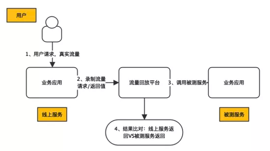
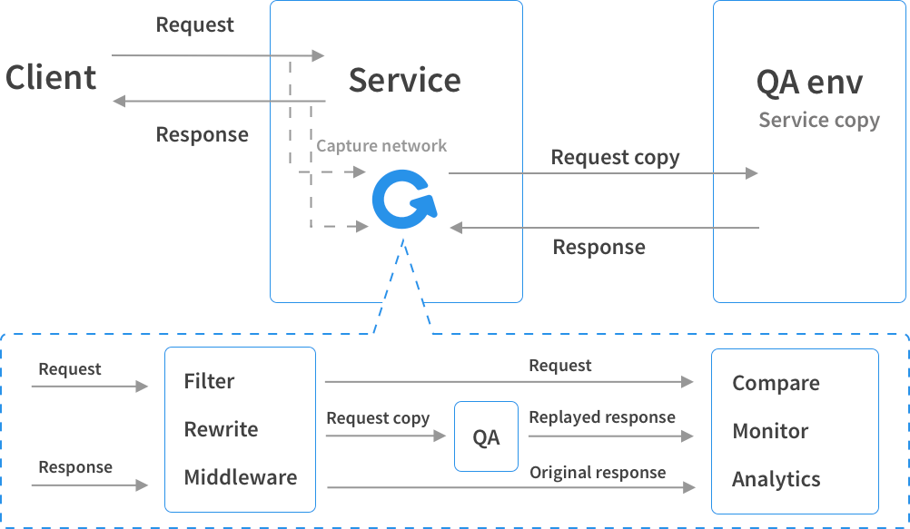
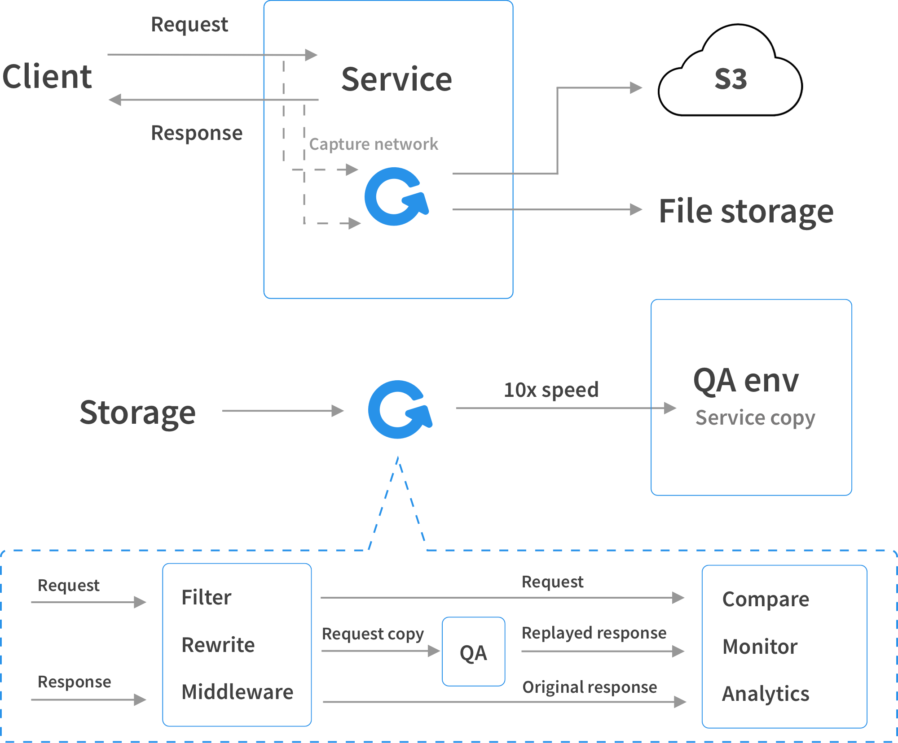
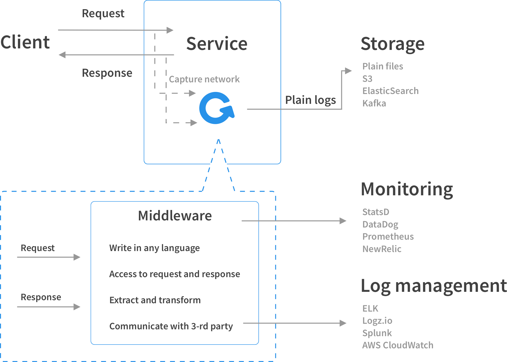

[TOC]

<h1 align="center">流量复制</h1>

> By：weimenghua  
> Date：2022.11.03  
> Description：流量复制

**参考资料**  
[GoReplay 官网](https://goreplay.org/)  
[GoReplay 源码](https://github.com/buger/goreplay)
[有赞流量回放在中台营销的实践](https://mp.weixin.qq.com/s/rlqXjr17u70nm1mgD8-r0g)


## 一、流量回放
流量回放是系统重构、拆分、中台化时重要的自动化回归手段。通过采集可录制流量，在指定环境回放，再逐一对比每个调用和子调用差异来发现接口代码是否存在问题。因为线上流量大、场景全面，可以有效弥补人工评估测试范围的局限性，进而降低业务快速迭代带来的风险。流量回放的整体流程图如下图所示。




## 二、GoReplay
### 2.1 GoReplay 简介
GoReplay 是一款开源网络监控工具，可以记录您的实时流量并将其用于跟踪、负载测试、监控和详细分析。 

[生产引流](https://goreplay.org/shadowing.html)  
录制生产环境的 HTTP 流量，镜像回放到测试环境。



[流量压测](https://goreplay.org/loadtesting.html)    
录制生产环境的 HTTP 流量，进行存储保存，根据录制的内容 加倍 或 缩量 回放 到测试环境。 



[分析与监控](https://goreplay.org/monitoring.html)  
支持把 HTTP 流量记录存储到 ElasticSearch、Kafka、本地文件 等存储设备，可以通过自定义插件的方式，处理 Request 和 Response。 




### 2.2 GoReplay 搭建
Go 环境搭建（非必须） 
[go 下载地址1](https://go.dev/dl/)  
[go 下载地址2](https://studygolang.com/dl)  

```
1、下载
wget https://go.dev/dl/go1.20.4.linux-amd64.tar.gz

2、解压到/usr/local 目录下
tar -zxvf go1.20.4.linux-amd64.tar.gz -C /usr/local

3、配置环境变量
vim /etc/profile

export GOROOT=/usr/local/go
export PATH=$PATH:$GOROOT/bin

source /etc/profile

4、验证
go env
```

### 2.3 GoReplay 搭建
```
1、下载
wget https://github.com/buger/goreplay/releases/download/v1.3.1/gor_1.3.1_x64.tar.gz
curl -L -O https://github.com/buger/goreplay/releases/download/v1.3.1/gor_1.3.1_x64.tar.gz

2、解压
tar -zxvf gor_1.3.1_x64.tar.gz

3、复制
cp gor /usr/bin/
或者
cp gor /usr/local/bin

4、验证
gor -h
```

### 2.4 GoReplay 使用
**使用 GoReplay 内置的 Server**
```
启动本地文件服务，使用两个窗口分别打开
gor file-server :8000
gor file-server :9000

返回的是当前目录下的文件列表
curl http://localhost:8000
curl http://localhost:9000
```

**流量复制**
```
打印请求到控制台
gor --input-raw :8000 --output-stdout

通过 --input-raw-track-response 追踪响应
gor --input-raw :8000 --input-raw-track-response --output-stdout

写入文件
gor --input-raw :8000 --output-file requests_origin.gor

读取文件
gor --input-file requests_origin.gor --output-http ""

放大流量 1000%就是放大10倍速度
缩小流量 50%
gor --input-file "requests_0.gor|1000%" --output-http="http://localhost:9000|50%"

通过 gor 监听 :8000 的流量，通过 --output-http 重放到 :9000 端口，在 :9000 所在的 Shell 窗口可以看到重放过来的请求
gor --input-raw :8000 --output-http="http://localhost:9000"
```

### 2.5 GoReplay 参数
输入

| 参数                           | 描述                                                         | 示例                    |
| ------------------------------ | ------------------------------------------------------------ | ----------------------- |
| --input-raw value              | 用于捕获 HTTP 流量，可以指定 IP 、网卡、端口                 | gor --input-raw :8080   |
| --input-raw-track-response     | 同时捕获 HTTP 响应，默认只捕获请求                           |                         |
| --input-file value             | 从 --output-file 生成的文件中获取流程，用于离线流量重放      |                         |
| --input-file-loop              | 循环 Replay --input-file                                     |                         |
| --input-file-max-wait duration | Replay 时默认按照请求间隔时间，该参数设置每个请求的最大间隔时间 | --input-raw-max-wait 1s |
| --input-tcp value              | 将多个 Gor 流量聚集到一个 Gor 实例，上游配合 --output-tcp    | --input-tcp :28020      |
| --input-raw-engine libpcap     | 默认 libpcap，可选 raw_socket、 pcap_file                    |                         |

输出

| 参数                | 描述                                                   | 示例                                  |
| ------------------- | ------------------------------------------------------ | ------------------------------------- |
| --output-stdout     | 用于调试，输出所有数据到 标准输出                      |                                       |
| --output-file value | 记录到文件                                             |                                       |
| --output-http value | 重放 HTTP 流量到给定的端点                             | --output-http 'http://localhost:9000' |
| --output-tcp        | 将数据转发给另一个 Gor 实例，下游配合 --input-tcp 使用 | --output-tcp hostname:28020           |


## 三、其它

查看开放的端口
```
netstat -tunlp
```

操作 nginx
```
1、查看 nginx 容器
k get pod -n my-space

2、进入 nginx 容器
kubectl exec -it pod/nginx-deployment-9456bbbf9-2478v -n my-space -- bash
kubectl exec -it pod/nginx-deployment2-9456bbbf9-624gb -n my-space -- bash

2、查看 nginx 日志
kubectl logs -f nginx-deployment-9456bbbf9-2478v -n my-space
kubectl logs -f nginx-deployment2-9456bbbf9-624gb -n my-space

3、浏览器访问 nginx
http://127.0.0.1:30004/
http://127.0.0.1:30005/

4、命令行访问 ngxin
踩坑：浏览器访问，gor 录制不到，命令行访问，gor 流量录制得到，重装之后浏览器访问的也能录制得到了。（没明白）
curl 127.0.0.1:30004
curl 127.0.0.1:30005

复制文件
1、复制本地文件到 pod
命令：kubectl cp <本地文件路径> <pod 名称>:<目录>
举例：kubectl cp /root/tmp/gor_1.3_RC1_x64.tar.gz nginx-deployment-9456bbbf9-2478v:/ -n my-space

2、复制 pod 文件到本地
命令：kubectl cp <pod 名称>:<文件/目录> <本地文件路径> -n <ns 名称>
举例：kubectl cp nginx-deployment-9456bbbf9-9g8zn:/requests_origin_0.gor /root/tmp/requests_origin_0.gor -n my-space
```
