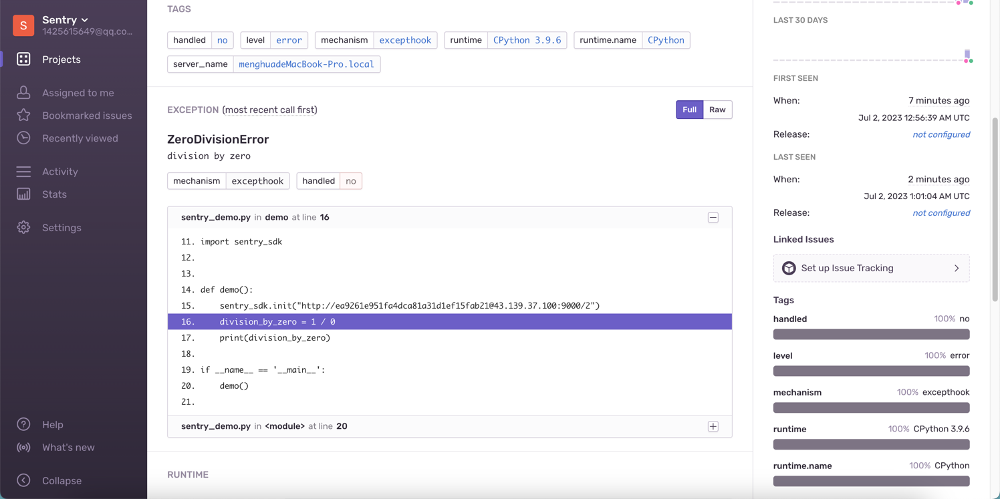

[TOC]

<h1 align="center">Sentry 日志监控</h1>

> By：weimenghua  
> Date：2023.06.29  
> Description：  

**参考资料**  
[sentry 官网](https://sentry.io)  
[sentry 开发文档](https://develop.sentry.dev/)   
[sentry 源码](https://github.com/getsentry/sentry)  


## 一、Sentry 搭建

### 方式一（未实践成功）

```
git clone https://github.com/getsentry/onpremise.git
cd onpremise
./install.sh

docker-compose up -d

访问地址
http://127.0.0.1:9000
```


### 方式二

```
1、启动 redis 和postgres
docker run -d --name sentry-redis --restart=always redis
docker run -d --name sentry-postgres -e POSTGRES_PASSWORD=secret -e POSTGRES_USER=sentry --restart=always postgres 

2、生成密钥
docker run --rm sentry config generate-secret-key

3、初始化数据结构
docker run -it --rm -e SENTRY_SECRET_KEY='<密钥>' --link sentry-postgres:postgres --link sentry-redis:redis sentry upgrade

4、启动 sentry 的三个容器
my-sentry：sentry 的web 服务
sentry-cron：sentry 的定时任务，活性检测等
sentry-worker：业务处理，数据持久化，报警等
docker run -d -p 9000:9000 --name my-sentry -e SENTRY_SECRET_KEY='<密钥>' --link sentry-redis:redis --link sentry-postgres:postgres sentry 

docker run -d --name sentry-cron -e SENTRY_SECRET_KEY='<密钥>' --link sentry-postgres:postgres --link sentry-redis:redis sentry run cron 

docker run -d --name sentry-worker-1 -e SENTRY_SECRET_KEY='<密钥>' --link sentry-postgres:postgres --link sentry-redis:redis sentry run worker 

5、访问 1425615649@qq.com/admin
http://127.0.0.1:9000
```


## 二、Sentry 接入

### Python

在 Sentry 新建 Python Project

```
import sentry_sdk


def demo():
    sentry_sdk.init("http://ea9261e951fa4dca81a31d1ef15fab21@127.0.0.1:9000/2")
    division_by_zero = 1 / 0
    print(division_by_zero)


if __name__ == '__main__':
    demo()
```

